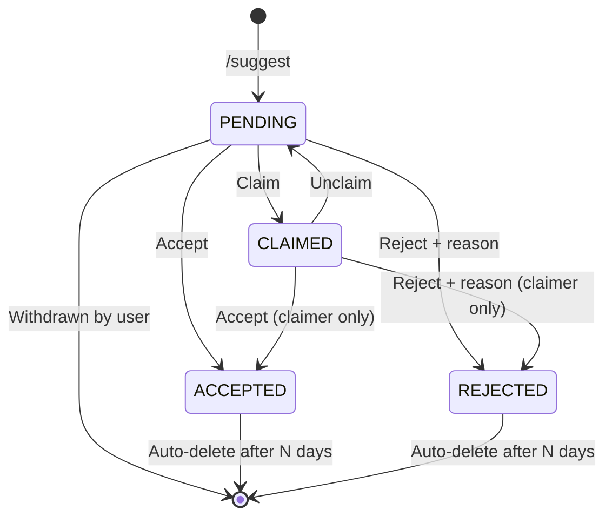

# Discord Suggestion Bot


A self-hosted Discord bot that lets server members **suggest new channels or roles**. An admin team reviews each suggestion with buttons in a private log channel and can claim, edit, accept or reject it. Accepted suggestions are created automatically.

No database required: everything is stored in JSON files, which makes it a good fit for small servers and a Raspberry Pi.

> [!NOTE]
> All user-facing bot messages are in **German**. Code, comments and commands are easy to adapt if you need another language.

🇩🇪 [Deutsche Version](README.de.md)

---

## Features

**For members**
- `/suggest` opens an ephemeral flow (visible only to the user): pick *channel* or *role*, then a target category, then fill in a form.
- The category dropdown only shows categories the member can actually see.
- Channel names are slugified automatically (`Off Topic Gaming` → `off-topic-gaming`). Roles can have an optional hex color.
- Confirmation is sent both ephemerally and via DM. The user also gets a DM when a decision is made, including the reason if rejected.
- `/my-suggestions` lists your open suggestions. Pending ones can be withdrawn, and past decisions are available as a history.

**For admins**
- A review embed with persistent buttons (🔍 Claim · 🔓 Unclaim · ✏️ Edit · 🟢 Accept · 🔴 Reject) is posted for every suggestion.
- **Claiming** locks a suggestion so no other admin can accept or reject it while you work on it.
- **Edit** lets you fix the name or color before accepting, without going back to the user.
- **Accept** creates the channel in the chosen category, with permissions synced from the category. For roles, it creates the role and assigns it to the member who suggested it.
- **Reject** requires a reason.
- Every action (claim, unclaim, edit, accept, reject, withdraw) is written as a line to a separate **audit log channel**.
- `/suggestions list` gives a compact overview of all open suggestions, with jump links. `/suggestions stats` shows the acceptance rate and top contributors.

**Safeguards**
- Each user can only have a limited number of open suggestions at once.
- After a rejection, the user must wait a configurable cooldown before suggesting again.
- The bot warns (without blocking) when a similar suggestion is already open or the name already exists.
- Decided suggestions are deleted automatically after *N* days. The statistics survive the cleanup.
- Files are written atomically and backed up before each write. A corrupted file is restored from its backup on startup.
- On startup the bot checks its configuration and permissions and sends any problems to the owner via DM.

## Suggestion lifecycle



## Commands

| Command | Who | Description |
|---|---|---|
| `/suggest` | Everyone | Start a new channel or role suggestion |
| `/my-suggestions` | Everyone | Your open suggestions, withdraw button and history |
| `/suggestions stats` | Everyone | Accepted / rejected / open counts, acceptance rate, top 5 |
| `/suggestions list` | Admin role | All open suggestions with links to their review embeds |
| `/setup-channels` | Administrator | Create a private category with log and audit channels, then save the config |
| `/set-suggestion-channel` | Administrator | Use an existing channel for review embeds |
| `/set-audit-log-channel` | Administrator | Use an existing channel for the audit log |
| `/set-admin-role` | Administrator | Set the role that may review suggestions |
| `/set-owner` | Administrator | Set who receives startup warnings via DM |
| `/set-limits` | Administrator | Rate limit, reject cooldown, auto-delete (no args = show values) |
| `/set-categories` | Administrator | Restrict which categories can receive channel suggestions |
| `/show-config` | Administrator | Show the current config and the result of the health checks |

> [!IMPORTANT]
> Configuration commands are protected by **two layers**:
> 1. `@app_commands.default_permissions(administrator=True)` hides them from everyone else in the `/` menu.
> 2. `@app_commands.checks.has_permissions(administrator=True)` checks the permission on every call. It still applies if a server owner changes command visibility under *Server Settings → Integrations*.
>
> A global error handler replies ephemerally when permissions are missing. The bot also **refuses to start** if a configuration command lacks either decorator.

## Setup

### 1. Create the bot

1. Open the [Discord Developer Portal](https://discord.com/developers/applications) and create a **New Application**.
2. Go to **Bot → Reset Token** and copy the token.
3. Under **Bot → Privileged Gateway Intents**, enable **Server Members Intent**. It is needed for assigning roles.

### 2. Invite it

Replace `CLIENT_ID` with your *Application ID*:

```
https://discord.com/oauth2/authorize?client_id=CLIENT_ID&scope=bot+applications.commands&permissions=268520464
```

This grants: View Channels, Send Messages, Embed Links, Read Message History, Manage Channels, Manage Roles.

> [!WARNING]
> The bot's role must be **above** any role it should assign. The bot must also be able to see and manage channels in every target category.

### 3. Install

```bash
git clone https://github.com/<you>/discord-bot.git
cd discord-bot
python3 -m venv .venv
source .venv/bin/activate        # Windows: .venv\Scripts\activate
pip install -r requirements.txt
cp .env.example .env             # then put your token into BOT_TOKEN=
```

### 4. Run

```bash
python main.py           # syncs slash commands only when they changed
python main.py --sync    # force a sync
```

### 5. Configure on your server

As a member with **Administrator** permission, run:

```
/setup-channels admin_role:@YourAdminRole
```

This creates a private **Vorschläge** category containing `#vorschlag-log` and `#vorschlag-audit` and saves everything to `config.json`. Check the result with `/show-config`.

> [!TIP]
> The first configuration command stores the server ID (`guild_id`) automatically. **Restart the bot once** afterwards. Commands then move from global registration (which can take up to an hour to show up) to instant server-specific registration.

<details>
<summary><b>Manual configuration (<code>config.json</code>)</b></summary>

| Key | Description | Default |
|---|---|---|
| `guild_id` | Server ID | set automatically |
| `log_channel_id` | Channel for review embeds and buttons | `null` |
| `audit_log_channel_id` | Channel for audit lines | `null` |
| `admin_role_id` | Role allowed to review suggestions | `null` |
| `owner_id` | Receives startup warnings; may release other admins' claims | `null` |
| `rate_limit_per_user` | Max. open suggestions per user (`0` = off) | `3` |
| `cooldown_after_reject_hours` | Cooldown after a rejection (`0` = off) | `1` |
| `auto_delete_after_days` | Delete decided suggestions after N days (`0` = off) | `30` |
| `allowed_categories` | Allowed category IDs; empty = all visible ones | `[]` |

To copy IDs, enable *Settings → Advanced → Developer Mode* in Discord, then right-click an item and choose **Copy ID**.

</details>

## Deployment (Raspberry Pi / systemd)

The bot is lightweight and runs well 24/7 on a Raspberry Pi. Raspberry Pi OS Bookworm ships Python 3.11.

```ini
# /etc/systemd/system/suggestion-bot.service
[Unit]
Description=Discord Suggestion Bot
After=network-online.target
Wants=network-online.target

[Service]
Type=simple
User=pi
WorkingDirectory=/home/pi/discord-bot
ExecStart=/home/pi/discord-bot/.venv/bin/python main.py
Restart=on-failure
RestartSec=10

[Install]
WantedBy=multi-user.target
```

```bash
sudo systemctl daemon-reload
sudo systemctl enable --now suggestion-bot
journalctl -u suggestion-bot -f
```

## Project structure

```
discord-bot/
├── main.py                     # entry point, command sync, global error handler
├── config.json                 # server configuration (no secrets)
├── .env.example                # BOT_TOKEN template
├── core/
│   ├── config_manager.py       # config.json
│   ├── storage.py              # suggestions.json + locking
│   ├── stats_manager.py        # stats.json (survives auto-delete)
│   ├── models.py               # Suggestion dataclass, enums
│   └── jsonio.py               # atomic writes + backups
├── cogs/
│   ├── suggestions.py          # /suggest, /my-suggestions
│   ├── admin.py                # review buttons, /suggestions stats|list
│   ├── setup.py                # admin-only configuration commands
│   └── tasks.py                # daily auto-delete
├── views/                      # dropdowns, modals, persistent review buttons
├── utils/                      # permissions, validation, rate limit, embeds, startup checks
└── data/                       # runtime JSON files (git-ignored)
```

## Design notes

- **Persistent buttons without per-message registration.** Review buttons use `discord.ui.DynamicItem` with a regex template (`accept:a1b2c3`, …). The template is registered once in `setup_hook`, so buttons keep working after a restart and the bot doesn't need to load a view for every open suggestion.
- **Concurrency.** The bot is a single asyncio process. A global lock protects file writes, and a per-suggestion lock serializes admin actions and withdrawals. This prevents, for example, two admins accepting the same suggestion at the same time.
- **Crash-safe storage.** Data is written to a `.tmp` file, flushed with `fsync`, then swapped in with `os.replace`. The previous state is kept as `.bak`.
- **Accurate stats.** Each suggestion has a `stats_counted` flag, so nothing is counted twice or lost when old entries are auto-deleted.

## Known limitations

- Single server per bot instance (by design).
- Discord dropdowns show at most 25 options. Use `/set-categories` if you have more categories.
- Members with the Administrator permission bypass channel permission overwrites. The private log channels are therefore only private for non-administrators.
- JSON storage is meant for small to medium servers, not for thousands of suggestions per day.

## Built with Claude

This project was designed and written together with **[Claude](https://claude.ai)**, an AI assistant by [Anthropic](https://www.anthropic.com). The feature spec came from me. Claude wrote the code, suggested design changes (such as persistent `DynamicItem` buttons, atomic JSON writes and the two-layer admin check) and wrote the documentation.

The code was checked with static analysis and simulated tests. As with any AI-assisted project, please review it and test it on a staging server before running it in production. Issues and pull requests are welcome.

## License

No license has been chosen yet. Until one is added, all rights are reserved by the author. See [choosealicense.com](https://choosealicense.com) if you want to add one (MIT is a common choice for bots like this).
